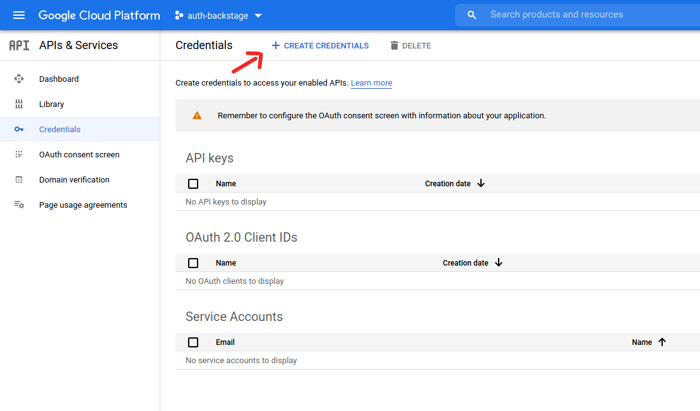
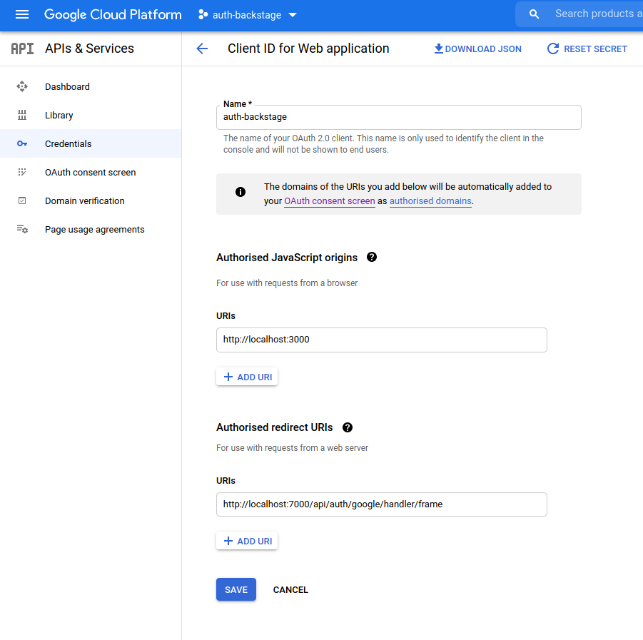
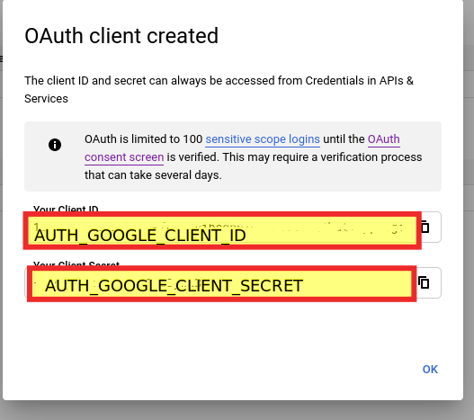

# Demo Backstage application with Auth providers

Google auth provider demo.

Set environment variables:
* `AUTH_GOOGLE_CLIENT_ID`
* `AUTH_GOOGLE_CLIENT_SECRET`

from the app set up in your Google cloud console.

Use `http://localhost:3000` as an authorized JavaScript origin.
Use `http://localhost:7000/api/auth/google/handler/frame` as an Authorised redirect URI.

Location in Google Cloud console where to find the setup:

Setting up JS origin and redirect URI:

Pop-up of needed client id and secret:

See more documentation in Backstage documentation page in: https://backstage.io/docs/tutorials/quickstart-app-auth
