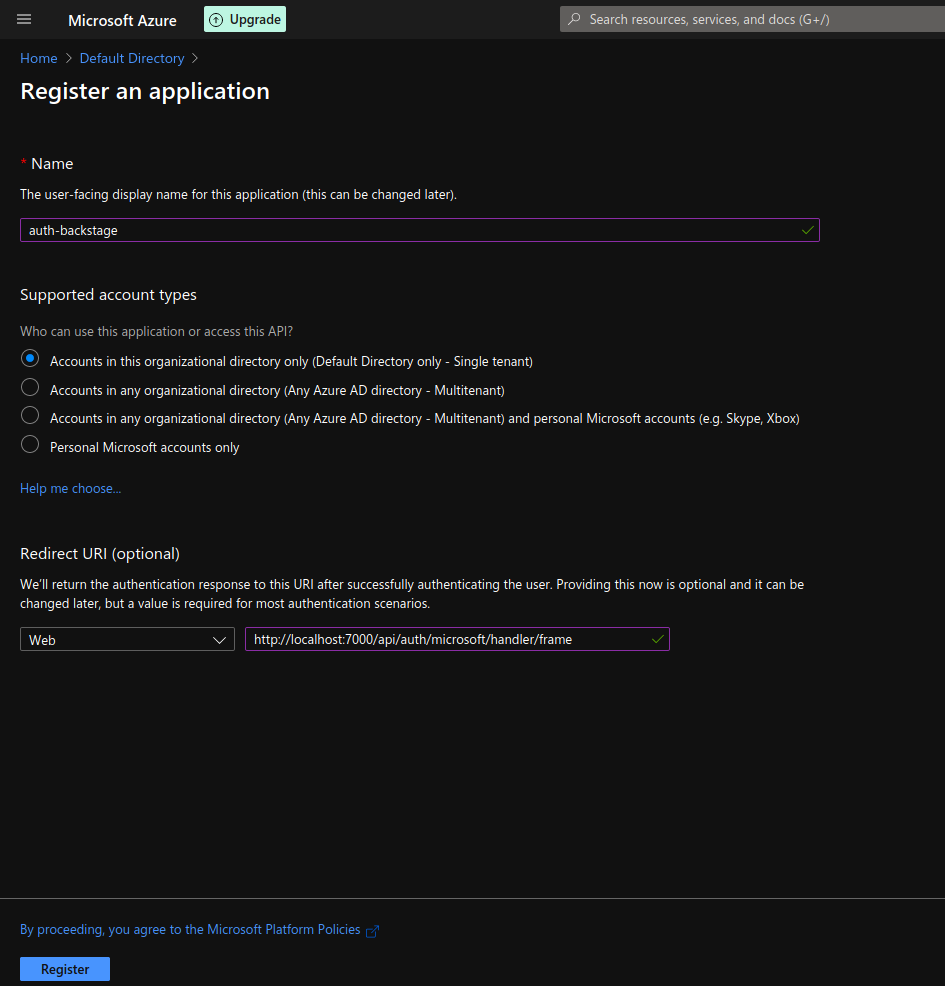
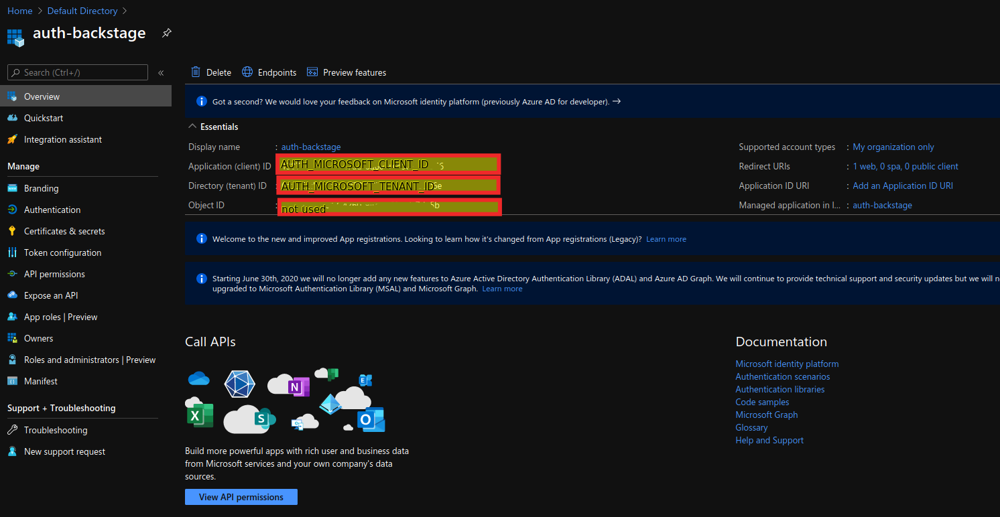
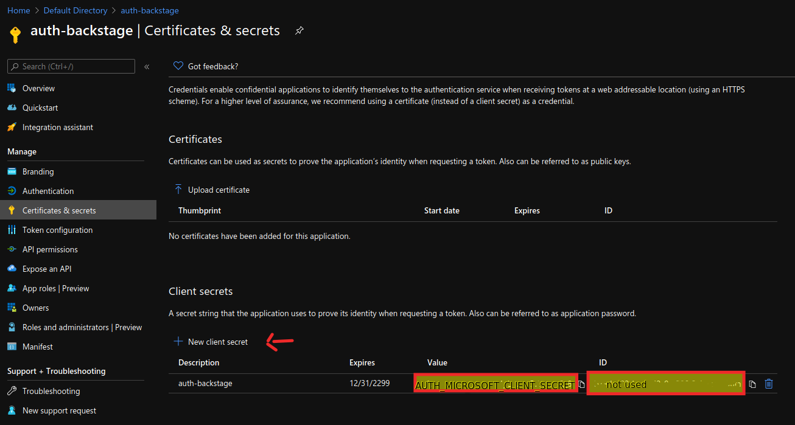

# Demo Backstage application with Auth providers

Gitlab auth provider demo.

Set environment variables:
* AUTH_MICROSOFT_CLIENT_ID
* AUTH_MICROSOFT_CLIENT_SECRET
* AUTH_MICROSOFT_TENANT_ID

from the app set up in your Azure Active Directory within Azure portal.

Use `http://localhost:3000` as redirect URI.
Use `http://localhost:7000/api/auth/microsoft/handler/frame` as authorised redirect URI.

Registering a new Microsoft Azure AD application:

Location of client and tenant IDs:

Location/Creation of client secret:

See more documentation in Backstage documentation page in: https://backstage.io/docs/tutorials/quickstart-app-auth
