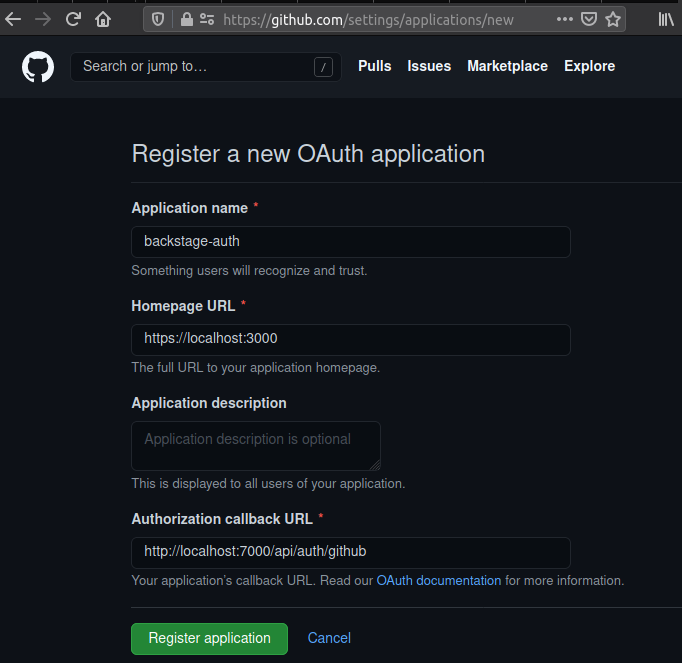
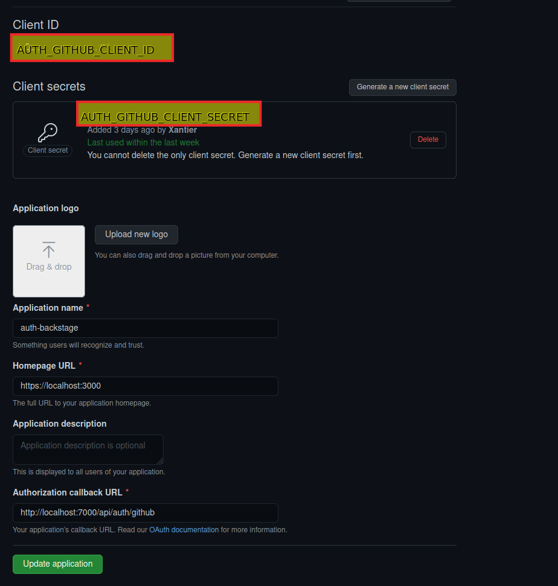

# Demo Backstage application with Auth providers

Github authentication demo application.

Set environment variables:
 * AUTH_GITHUB_CLIENT_ID
 * AUTH_GITHUB_CLIENT_SECRET

Creating a new OAuth App in Github:

Location of client ID and Secret:

See more documentation in Backstage documentation page in: https://backstage.io/docs/tutorials/quickstart-app-auth
